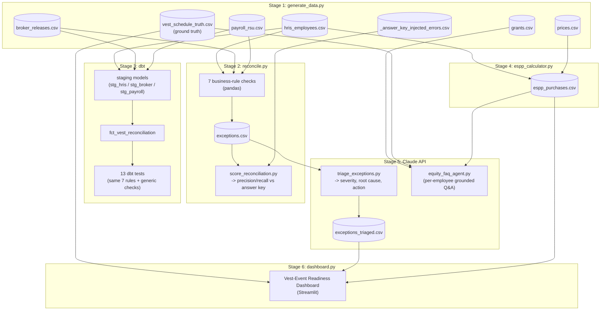

# Process Map

How data moves through the toolkit, stage by stage, and where each control
sits.

## Pipeline architecture

## What each stage is responsible for

| Stage | Responsibility | Reads | Writes |
|---|---|---|---|
| 1 | Generate a synthetic HRIS/broker/payroll population with known injected errors | - | `hris_employees.csv`, `grants.csv`, `vest_schedule_truth.csv`, `broker_releases.csv`, `payroll_rsu.csv`, `prices.csv`, `_answer_key_injected_errors.csv` |
| 2 | Cross-check the three source feeds in Python and flag exceptions | HRIS, broker, payroll | `exceptions.csv` |
| 3 | Rebuild the same checks as dbt models + tests (automated controls) | HRIS, broker, payroll | `dbt/warehouse.duckdb` (local, not committed) |
| 4 | Simulate ESPP purchases (lookback, discount, IRS limit) | HRIS, prices | `espp_purchases.csv` |
| 5 | Triage exceptions with Claude; answer employee equity questions | `exceptions.csv`, grants, vest schedule, ESPP | `exceptions_triaged.csv` |
| 6 | Surface next-vest readiness, exception backlog, ESPP status | vest schedule, triaged exceptions, ESPP | (dashboard only, no file output) |

## Quarterly vest cycle (how this would run in production)

RSUs here vest quarterly (15th of Mar/Jun/Sep/Dec). A Stock Admin team would
run this toolkit's later stages against real source-system extracts on
roughly this cadence:

1. **T-7 days**: Pull fresh HRIS, broker, and payroll extracts for the
   upcoming vest date. Check the Stage 6 dashboard's "Next vest event" panel
   for headcount/share/dollar exposure.
2. **T-5 days**: Run Stage 2 (`reconcile.py`) and Stage 3 (`dbt test`)
   against the extracts. Any of the 7 controls failing is a signal to
   investigate before vest day, not after.
3. **T-4 days**: Run Stage 5 triage (`triage_exceptions.py`) to get a
   severity-ranked backlog. High-severity items (forfeiture leakage,
   incorrect withholding, missing payroll lines) get worked first.
4. **T-1 day**: Re-run reconciliation to confirm the backlog is clear or
   explicitly accepted. Check the dashboard one more time.
5. **Vest day**: Broker releases shares, payroll runs. The employee FAQ
   agent (`equity_faq_agent.py`) is available for employee questions about
   what they received.
6. **T+7 days (ESPP purchase dates only)**: Run `espp_calculator.py` for any
   ESPP purchase period landing in the same window and reconcile the results
   against the broker's actual purchase confirmation.

This toolkit currently runs Stages 2-6 against a single synthetic snapshot
(Stage 1's `data/`), not a live rolling feed - the cadence above is how the
same scripts would be scheduled against real, recurring source-system
extracts.
